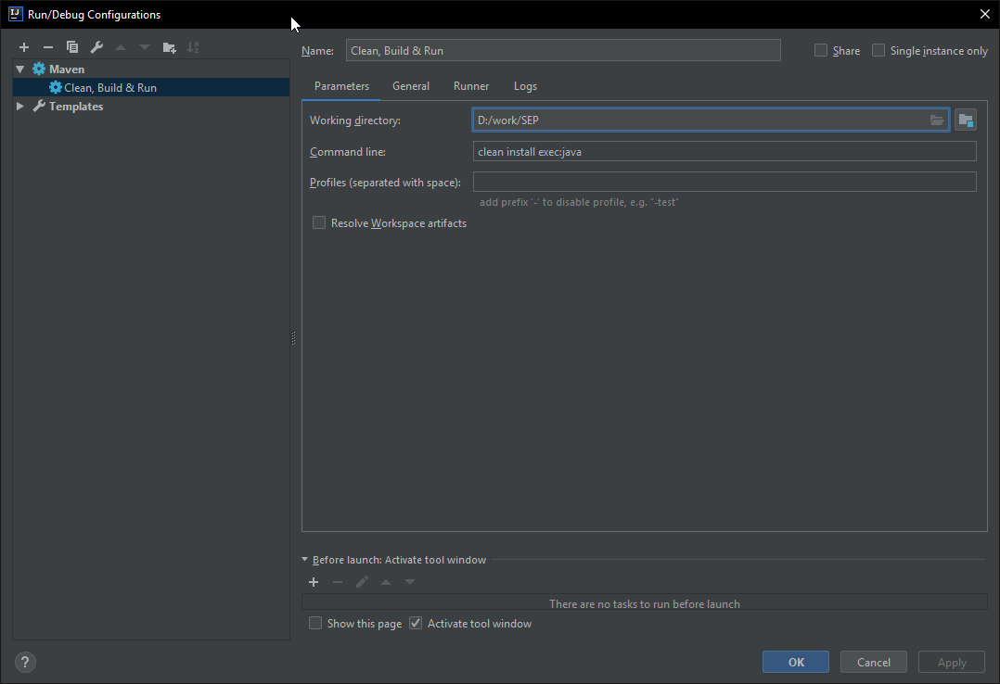

**Setup**

To build and run this project your IDE needs to be configured to use  
maven and you need to add the following three goals to your run  
configuration:

* clean
* install
* exec:java

The required plugins are already present in this projects pom.xml

In IntelliJ this would look like this: 

